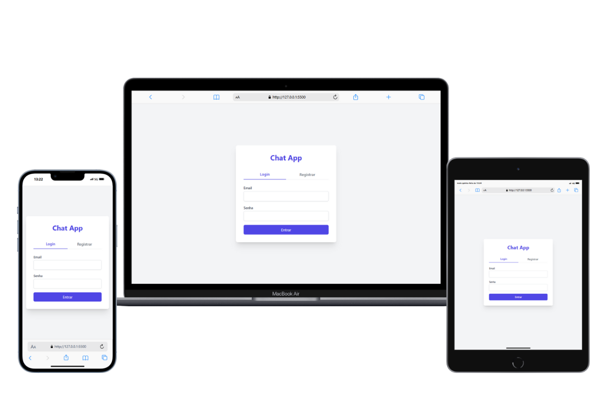

## **Chat App ✅**

## **💡 Informações sobre o projeto**
Tela de login moderna e responsiva 2025. Para diferentes tipos de dispositivos utilizando todo o poder do Tailwind CSS.

## **✨ Destaques do projeto**
- *Design responsivo que se adapta a diferentes tamanhos de tela.*
- *Desenvolvimento com **Next.js**, **Node.js**, e **TypeScript** para uma experiência de aplicação moderna e robusta.*
- *Estilização utilizando **Tailwind CSS** para construir layouts customizados de forma rápida e eficiente.*
- *Adoção de melhores práticas de front-end, garantindo uma interface limpa e acessível.*
- *Utilização de tecnicas de componentização utilizando interface.*

## **⚙️ Tecnologias utilizadas**
- **Next.js**: Framework Next JS para desenvolvimento de aplicações web.
- **Node.js**: Ambiente de execução para JavaScript (TypeScript) no lado do servidor.
- **TypeScript**: Superset do JavaScript para adicionar tipagem estática.
- **Tailwind CSS**: Framework de CSS utilitário para uma construção rápida e customizável de layouts.

## **🛠️ Instalação**
Certifique-se de que o Node.js esteja instalado na sua máquina.
Para acessar a pasta do projeto, execute o comando:
`cd nome-da-pasta`
Para rodar o projeto localmente, utilize o comando:
`npm run dev`

## **👨‍💻 Autor**
**Nome:** Dllacy de Lima Rocha

## **📜 Licença**
Este projeto está sob uma licença aberta. Isso significa que você pode usar, modificar, copiar e distribuir o código como quiser, sem precisar pedir permissão ou dar créditos ao autor. Use em projetos pessoais, escolares, comerciais ou qualquer outro propósito. O objetivo é compartilhar conhecimento e facilitar a vida de todos!

